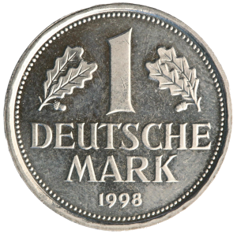

# **Deutsche Mark NFT on Cardano**

A complete collection of Deutsche Mark banknotes and coins, [55 unique assets](https://cexplorer.io/policy/8ae267e137282dcac8951a8b1880d97271a44bb131e990424e3ab367).

*Official source of images:* Deutsche Bundesbank, Frankfurt am Main

> The **Deutsche Mark**, abbreviated "**DM**" or "**D-Mark**", was the official currency of West Germany from 1948
> until 1990 and later the unified Germany from 1990 until the adoption of the euro in 2002. In 
> English, it was typically called the "**Deutschmark**". One Deutsche Mark was divided into 100 pfennigs.
>  
> *[Deutsche Mark](https://en.wikipedia.org/w/index.php?title=Deutsche_Mark&oldid=1123406579), Wikipedia*

---

[Impressum](https://philipphenkel.github.io/impressum/) | [Legal Information](https://philipphenkel.github.io/impressum/) | PolicyID: [8ae267e137282dcac8951a8b1880d97271a44bb131e990424e3ab367](https://pool.pm/policy/8ae267e137282dcac8951a8b1880d97271a44bb131e990424e3ab367)
